# 이호인 포트폴리오
# :stew: **OTS** - [배포 사이트](https://ots-amber.vercel.app/)

<span style="font-size : 19px">**식단관리 SNS** 
<br>
(개인 프로젝트) - 프론트엔드,백엔드
</span>
<br>
참고페이지 - pinterest, instagram
<br>
### **사이트 미리보기**<br>
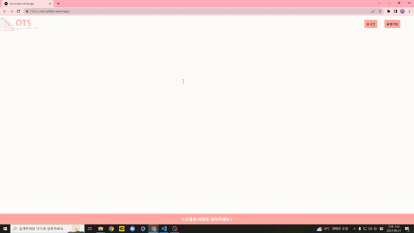
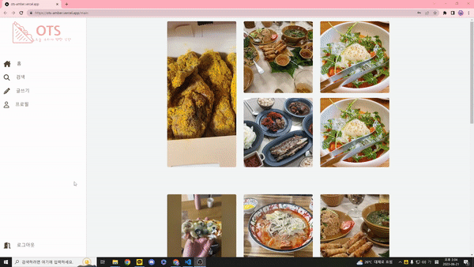
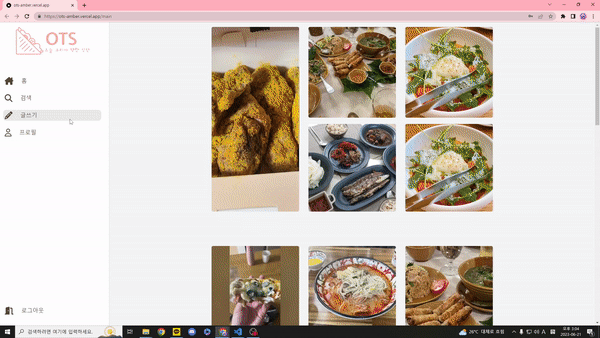
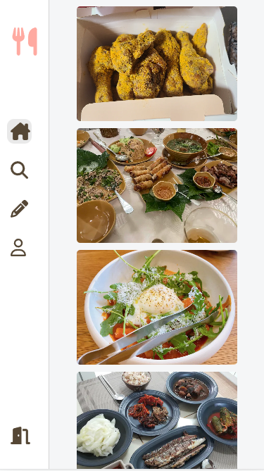
<br>

>## 1. 제작기간 & 참여인원

- 2023.05.20 ~ 2023.06.10
- 3명으로 Spring 백엔드 1인, 프론트 엔드 2인이었지만 개인사정으로 중반부터 Next.js로 1인개발

<br>

>## 2. 사용기술

Front-end
- React 18
- TypeScript 5
- Axios 1.4
- Fontawesome 6
<br>

Back-end
- Next.js 13.4
- mongodb 5.5
- firebase/storage
- Next auth 4
- bcrypt 5
- dotenv

<br>

>## 3. 구현기능

### 3-1. 메인페이지 :mag: [코드확인](https://github.com/hoinlee-moi/OTS/blob/main/components/home/Sections.tsx#L23)
<br>
첫 접속시 사이트를 소개하기 위한 페이지를 구현했고 scroll이 일어날 때마다 한 section씩 이동하도록 구현하였습니다. <br>
또한 상단 고정 navbar를 통해 회원가입과 로그인을 modal창으로 가능하도록 했습니다.<br><br>

<details>
<summary style="cursor : pointer;">기능 설명 펼치기</summary>

- 이번 프로젝트에선 슬라이드 형식의 스크롤 애니메이션을 사용하고 싶어 useEffect와 useState를 이용해 휠 이벤트가 일어날 시 한 섹션씩 이동하도록 했습니다.
- 휠 이벤트이기 때문에 보통 유저는 휠을 여러번씩 사용한다 예상하여 state값을 추적, 섹션 이동이 완전히 끝나기 전엔 이벤트가 실행되지 않도록 했습니다.
- header의 고정된 nav bar에 로그인 회원가입 버튼을 붙여 페이지 이동 없이 로그인, 회원가입이 가능하도록 했습니다.
- keyframe 애니메이션과 딜레이를 계산하여 첫번째 section에서 이미지들이 로딩되도록 했습니다. 이후 setTimeOut을 통해 state값을 관리하여 이미지 애니메이션이 무한히 지속되도록 했습니다.<br>


</details>

<br>

### 3-2. 회원기능 :mag: [코드확인1](https://github.com/hoinlee-moi/OTS/blob/main/components/home/Login.tsx)[코드확인2](https://github.com/hoinlee-moi/OTS/blob/main/components/home/SignUp.tsx)
<br>
Next Auth를 이용해 로그인을 구현하였고 MongoDB 검사를 통해 통과시 JWT,session을 통해 로그인 상태와 로그인한 유저 정보를 쿠키에 저장되도록 구현하였습니다. <br>
회원가입은 동작 전 각 입력값이 벗어날 때 onBlur를 이용해 유효성 검사와 email과 nickname에는 중복 검사가 되도록 구현하였습니다.<br>
profile 페이지에서 Next.js의 Dynamic Routes를 통해 유저 닉네임을 전달하였고 session에 저장된 로그인 데이터와 같다면 프로필 편집이 가능하도록 했습니다.<br>


<details>
<summary style="cursor : pointer;">기능 설명 펼치기</summary>

- Next Auth의 CredentialsProvider를 통해 구현하였고 바로 MongoDB 검사를 통해 통과될 경우 callback의 JWT,sessoin에 userData를 담아 전달합니다.
- 회원가입시 MongoDB에 회원 정보 데이터를 저장하며 각각 email과 nickname, 비밀번호는  백과 프론트에서 양쪽으로 유효성 검사를 진행했습니다.
- DB와 중복검사를 nickname과 email에서 각각 진행되도록 했습니다.
- bcrypt를 사용해 비밀번호를 hash화 시켜 비밀번호 그 자체가 저장되지 않게 하였습니다.
- 프로필 페이지는 params로 받은 nickname을 통해 유저데이터를 불러왔고 session 데이터를 이용해 편집 기능을 모달창으로 가능하게 만들었습니다.
- 프로필 편집을 통해 프로필 이미지, 성별, 비밀번호, 닉네임등을 변경할 수 있었고 프로필 이미지는 firebase를 통해 저장과 삭제를 진행했고 db에는 이미지의 url을 저장하였습니다
- 프로필 수정시엔 댓글과 게시글에 저장된 프로필 이미지 url도 전부 변경되도록 만들었습니다.

</details>

<br><br>

### 3-3. 게시판 기능 :mag: [코드확인](https://github.com/hoinlee-moi/OTS/blob/main/components/mainBoard/PostBoard.tsx)
<br>
페이지의 가장 중요한 부분이고 댓글을 포함하여 게시글과 댓글은 전부 DB에 저장하였습니다. <br>
이때 게시글 db에 너무 많은 데이터가 들어가지 않도록 댓글 테이블을 따로 구성하여 저장했습니다.<br>
update를 사용할 땐 세션에 저장된 id정보와 각 게시글과 댓글에 저장된 id를 백과 프론트에서 검사하도록 구현하였습니다.

<br><br>

<details>
<summary style="cursor : pointer;">기능 설명 펼치기</summary>

- 전체적인 SNS 느낌은 굉장히 가볍게 진행하고자 했고 페이지 이동 없이 모달창을 이용했습니다.
- 이부분은 모달창은 그대로 가져가지만 URL변경을 통한 뒤로가기를 만들었다면 모바일 환경에서의 유저 사용감을 높일 수 있었다 생각하고 아쉽습니다.
- state값을 통해 모달창을 컨트롤 하도록 하였고 drag&drop기능을 이용한 이미지 파일을 받도록 했습니다.
- 이미지 데이터가 저장되기 전 클라이언트에서 firebase에 접속 이미지 파일들을 저장하고 url을 다시 받아 db에 저장되도록 구현하였습니다.
- 오픈API를 통해 음식의 영양 성분과 칼로리를 가져오고 선택한 음식 데이터 값들과 총 합을 따로 계산하여 저장될 수 있도록 했습니다.
- 수정과 삭제시는 서버와 클라이언트 양쪽에서 유저 검사를 하도록 진행했습니다.<br>


</details>

<br><br>

### 3-4. 오픈 API를 활용한 음식 영양소 :mag: [코드확인](https://github.com/hoinlee-moi/OTS/blob/main/app/api/post/foodSearch/route.ts)
<br>
공공 데이터 포탈의 서비스를 이용해 식품 영양성분 정보를 검색할 수 있게 만들었습니다.<br>
모달창 내에서 검색하도록 하였고 비슷한 이름의 음식들을 최대 40개까지 불러올 수 있게 하였고 선택시 글 작성시 음식 이름, 영양 성분들을 저장할 수 있도록 구현하였습니다.

<br><br>

### 3-5. 게시판 무한스크롤 기능 :mag: [코드확인1](https://github.com/hoinlee-moi/OTS/blob/main/components/mainBoard/PostBoard.tsx) [코드확인2](https://github.com/hoinlee-moi/OTS/blob/main/hooks/useObserve.ts)
<br>
커스텀훅을 이용하여 게시판 글 마지막에 붙어있는 공간을 옵저빙 하여 스크롤을 통해 유저 화면에 들어올 경우 다음 페이지의 글을 불러오도록 구현하였습니다 <br>
한번 로드시 15개씩 가져올 수 있도록 했고 MongoDB의 쿼리를 사용하였고 더이상 불러올 데이터가 없을 때의 상태값을 보내 로딩이 더 진행되지 않도록 했습니다<br>
또한 setTimeOut을 이용해 여러번 요청이 들어가 page가 늘어나는 것을 방지했습니다.

<br><br>

### 3-6. firebase storage를 통한 이미지 파일 관리 :mag:[코드확인](https://github.com/hoinlee-moi/OTS/blob/main/util/firebase.ts)

<br>

처음엔 DB에 이미지를 저장하려 계획했지만 데이터당 저장되는 한계값도 존재하며 데이터 자체가 너무 무거워지는 것 같아 외부 데이터 저장소를 고민했습니다.<br>
이전 프로젝트처럼 S3를 사용할까 했지만 AWS의 과금 문제도 있고 Firebase의 storage를 사용하여 이미지를 업로드 하고 프로필 이미지가 변경되거나 글등이 삭제될 때 storage의 이미지 파일들도 삭제될 수 있도록 구현하였습니다.


<br><br>

>## 4. 핵심 트러블 슈팅
<br>

4-1. 이미지 로딩 속도 <br>
- 현재도 맨처음 로딩시엔 페이지는 느리지 않게 들어오지만 컴포넌트, 그 중에서 특히 이미지 데이터가 많이 들어가다보니 로딩이 느리고 띄엄띄엄 뜨는 경우가 있었습니다.<br>
- 아예 로딩 안된 이미지가 빈공간으로 뜨는 것 또한 유저 사용감을 매우 떨어뜨린다 생각하여 이미지 최적화를 찾던중 Next.js의 Image태그를 사용하는 방법을 공식문서를 통해 공부했습니다.<br>
- Next.js Image태그를 사용해 기본 html의 image태그를 전부 교체 시켰고 태그의 placeholder='blur'를 사용해 이미지가 뜨기전 빈 공간을 채울 수 있도록 했습니다.

<br>

4-2. formData 전송시 Next.js 버전별로 다른 문제
- 처음 진행시 가장 최신으로 나온 app디렉토리의 api폴더를 사용하지 않고 루트 폴더로 pages를 만들어 api를 만들었습니다.
- 이에 기본적인 string의 데이터는 제대로 통신하였지만 formData의 경우 도착하지 않는 상태가 되었고 찾아보니 Next.js는 통신시 따로 헤더에 타입을 담지 않아도 됐는데 타입 문제일까 싶어 작성해 봤지만 여전히 에러가 생겼습니다
- 관련하여 Next.js로 formData를 받을 때 특정 라이브러리를 사용해야 하는 것을 구글링을 통해 알았고 라이브러리 설치를 최소화 하고 싶어 공식문서를 찾아보니 가장 최신 app디렉토리를 사용하는 방법에 formData를 처리하는 방법이 나와 해결하였습니다.
- app폴더의 api폴더로 서버 코드를 전부 이사하였고 공식문서를 따라 서버 통신 코드를 변경하여 잘 진행되었습니다.

<br>

4-3. firebase 서버 에러
- 이미지 파일을 firebase storage에 저장하려 했지만 Next.js 서버단에선 firebase 접속이 실패하는 에러가 생겼습니다
- 이는 서버는 nodeJS를 api폴더에서 사용하지만 firebase Web 9 SDK를 사용하고 있기에 생긴 문제였고 시간상의 문제로 짜여진 코드들을 삭제하기 어렵다고 판단하여 클라이언트에서 파이어베이스에 접근할 수 있도록 변경하였습니다.

<br>

4-4. CSS파일이 코드를 변경하고 저장할 때마다 쌓이는 문제
- 프로젝트 작업을 진행하던 중 속도가 점점 느려지는 것을 발견하고 크롬 개발자 도구를 확인해 보니 error는 아니지만 동일한 오류가 꾸준하게 쌓여있는 것을 발견했습니다.
- 이에 추적을 해보니 동일한 CSS 파일들을 코드 변경후 저장할 때마다 똑같이 로드 하여 웹에 누적되는 문제가 있었습니다.
- 이에 검색을 통해 똑같은 Next.js 13.4 버전에서 동일한 오류를 가진 사람이 많았고 이에 CSS google font조정, CSS파일 조정, Link 태그의 prefetch를 조정하기도 했지만 여전했고 현재도 사이트에서 문제에 관해 토론중에 있습니다.
- 다만 이는 개발 도중 생기는 문제로 배포후엔 완전히 사라지는 것을 확인했고 좀 더 찾아보니 Next.js 13.4 버전 자체에서 생긴 문제로 버전 업을 기다리거나 좀 더 안정된 버전으로 내리는 방법이 있습니다.
- 개발 시 불편함이 쌓인다면 버전을 다운그레이드 하는 것이 좋다고 생각합니다.

<br>

4-5. 스크롤링 및 클릭 이벤트 연속 발생

- 무한 스크롤을 진행할 때 Loading이 진행되는 동안 스크롤에 마지막에 존재하기 때문에 계속해서 데이터를 불러들이는 현상이 있었습니다
- 이에 home페이지를 만들 때 스크롤링이 되는 시점에서 스크롤이 동작되게 만든 부분을 생각하고 동일하게 state상태값을 통해 데이터 fetch가 진행되지 않도록 픽스했습니다.
- 픽스 후 관련해서 서버나 db의 부하가 일어나지 않도록 state값을 통해 버튼을 클릭시 loading circle을 이용해 버튼을 사라지게 하고 유저에게 진행도를 알려주거나  비활성화 하는 방법으로 모두 변경하였습니다.

<br>

4-6. recoil 사용 실패

- 프로젝트 진행 시 props 드릴링이나 역으로 전달할 값등 전역적인 상태관리가 필요하다 느껴 이전 프로젝트 연습 때 사용했던 recoil을 사용하려 했지만 실패했습니다.
- 이유는 Next.js 13에 들어오며 모든 페이지의 디폴트값이 SSR이 된것을 공식 블로그를 통해 확인했고 'use client'를 이용할 경우 CSR로 변경 가능하였습니다.
- 다만 recoil같은 경우 중앙 집중화된 상태관리로 이를 사용하려면 전체 페이지에 CSR을 적용시켜야 했습니다. 이에 SSR의 검색 엔진이나 초기 사이트 로딩 같은 이점을 버리기에 아쉽다고 생각하여 React 기본 상태관리 훅인 useContext를 사용하여 필요한 부분에만 상태관리를 할 수 있도록 변경하였습니다.
- 이후 recoil에서 패치가 있을 경우 다시 한번 사용해봐도 괜찮다 생각합니다.

<br>

4-7. DELETE method 사용시 데이터 전송

- DELETE method를 사용시 데이터 전송시 body에 데이터를 담을 수 있지만 현재 Next.js13 에선 .json()을 이용해 데이터를 꺼내다보니 제대로 전달되지 않는 문제가 있었습니다.
- url 끝에 ?를 붙여 파라미터로 보낼 수 있었지만 user의 db아이디 넘버등이 노출되는 것을 염려하여 POST를 변경하여 진행시켰습니다.
- 보안을 위해 id넘버값도 hash로 변경시켜 진행후 compare로 비교했으면 더 좋았을 것 같다는 생각이 듭니다.

<br>

4-8. vercel 배포시 환경변수 문제
- 기존 .env에 작성 후 개발중이던 프로젝트를 곧 바로 vercel에 배포 시도 해 봤지만 계속 DB데이터에 접속할 수 없다는 오류가 생겼습니다.
- 에러를 검색 후 에러 위치 코드와 git에 올라간 코드를 확인중 .gitignore를 이용해 .env파일은 보안상 push하지 않도록 설정해 놓은 걸 놓친 상태였습니다.
- git을 이용한 배포를 했을 때도 똑같이 환경변수 처리하던 것이 기억나 vercel도 관련하여 검색해보니 똑같이 설정하는 것이 있어 배포 전 .env에 적어놓은 환경변수를 전부 옮겨 적으니 무사히 배포 완료 

<br><br>

> ## 5.회고 느낀점

### [개인 블로그](https://velog.io/@lee_moi/%ED%94%84%EB%A1%9C%EC%A0%9D%ED%8A%B8-%EB%A7%88%EB%AC%B4%EB%A6%AC-%ED%9A%8C%EA%B3%A0)를 통해 작성하였습니다.

<details>
<summary style="cursor : pointer;">회고 펼치보기</summary>
  원래 일찍 시작했었던 프로젝트를 다시 새로나온 NEXT.JS 13 버전과 더불어 공부한 퍼블리싱 지식으로 아예 새롭게 시작했다.<br>
시작하면서 팀원을 한명 구하기도 했는데 진행 중간에 개인 사정으로 빠지게 되어 결국 1인 개발이 되었다.<br>
Next.js와 react, mongoDB를 사용해서 프로젝트 만든 후 vercel을 통해 배포 했는데 처음 시작할 때 잡은 볼륨을 인원이 줄어들다보니 그대로 유지하기 힘들 것 같아 줄일 수 밖에 없었다.<br>
많이 아쉬운 결과고 실제로 구성이나 연결부분에서도 아쉽다란 생각이 많이 드는데 그만큼 어떻게 변경하고 진행해야할지 새롭게 알게 된 부분도 많다고 생각해 다음에 진행할 때는 더욱 예민하고 섬세하게 진행해 볼 수 있을 것 같다.<br>
<br>
  
> ### 유지할 것

- 공식문서는 신이다. 물론 유형별로 어떻게 써야하는지 예시같은 걸 찾기 힘들겟지만 github 예시 코드를 링크로 연결한 부분도 많으니 최대한 많이 비교해보자.
- 지속적인 확인은 꾸준히 유지하자. 중간중간 머릿속에서 이미 통신과 모든 게 끝났겠지만 최적화를 할 때 에러가 생겼지만 미리 체크 해놓은 구간 덕분에 빠르게 디버깅 할 수 있었다.
- 직접 물어보자. 스택오버 플로우나 github, 블로그등을 통해서 정보를 받아오는 것도 좋지만 직접 코드와 함께 현상과 시도 방법, 에러 발생 원인등을 잘 정리해서 올리면 좋은 답변을 기대할 수 있었다.
<br><br>
  
> ### 고쳐야할 것

- 너무 마음이 급하다 보니 성격대로 진행하지 못했다. 꼼꼼하고 세심하게 어떻게 진행할 것이지 어떠한 방법으로 구성을 짤것인지 하나하나 진행할 때마다 체크하며 나아가야 했지만 인원이 부족해지면서 마음을 너무 조급하게 먹은 것 같다.
그로 인해 너무 꼬여진 코드들이 존재 했으며 전체적으로 무거운 프로젝트가 되지 않았나 싶다.
- 되는대로 코드를 짜겠지만 이후 좀 더 코드를 리뷰하며 깔끔한 코드로 나아갈 수 있도록 하자.
- 상단에서 이야기 하든 구성면에서 많이 허둥지둥 하다보니 컴포넌트 세분화가 잘 진행되지 않은 것 같다. 파일이 늘어나는 것을 겁먹지말자
- 퍼블리싱 공부도 필요하고 UX/UI 측면에 대해 좀 더 고민하는 자세가 필요할 것 같다.
- 특히 색상이나 디자인 측면에서 데이터를 수집해서 진행해야겠다는 생각이 든다. 천재적인 게 아닌이상 미적 감각도 빅데이터다. 보고 경험한 게 많으면 저절로 떠오르기 마련이다.
<br><br>
  
> ### 이후 계획

- 부족한 CS지식과 추가적으로 공부하고 세분화된 프로젝트를 또 진행해보고 싶다.
- 웹 퍼블리싱을 좀 더 공부하고 sass를 배워 좀 더 유저 친화적인 인터렉티브한 웹을 만들고 싶다.
- native 공부를 시작해서 유저가 웹과 앱 둘 다 경험할 수 있는 프로젝트를 진행하고 싶다.
  </details>


<br><br>
---

# :sweet_potato: **GogumacatFrontEnd**
<span style="font-size : 19px">**중고물품 대여 플랫폼 <br>
(팀프로젝트) - 프론트엔드**</span> <br>
[팀 github - 프로젝트 관련 commits확인하기](https://github.com/sparta-cloud-a3/GogumaCat-FrontEnd)


<br>

### 사이트 미리보기

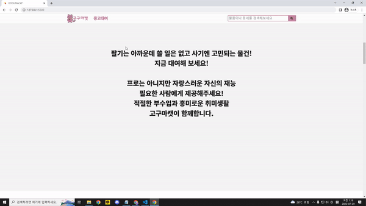
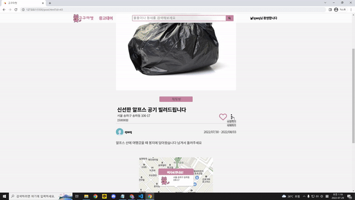
<br>
<br>


>## 1. 제작기간 & 참여인원

<br>
<li>2022-05-06 ~ 2022-07-29</li>
<li>3명 -> 백엔드 2명 , 프론트엔드 1명 </li>

<br>
<br>

>## 2. 사용기술

<br>
<ul><span style="font-size : 18px; font-weight : bold">Front-end</span>
<li>Javascript</li>
<li>jQuery 3.6.0</li>
<!-- <li>vue.js</li> -->
<br>
</ul>
<ul><span style="font-size : 18px; font-weight : bold">Back-end</span>
<li>Java 8 </li>
<li>Spring Boot 2.7.0</li>
<li>Gradle</li>
<li>Spring Data JPA</li>
<li> MySQL </li>
</ul>

<br>
<br>

>## 3. 내가 맡은 기능
<br>

### 3-1. **디자인 적인 부분**
프론트엔드는 눈에 보이는 영역으로서 디자인 적 요소나 순간적으로 확 끌어당길 수 있는 요소가 필요하다 생각했습니다. <br>
의도는 명확하지만 실력적인 부분이 모자라 주로 유명 사이트들의 디자인을 참고 하였습니다.<br>
(당근마켓, 라인, 토스, 애플스토어 등)<br>
<br>
<details>
<summary style="cursor : pointer;">기능 설명 펼치기</summary>

*  <span style="font-size : 15px; font-weight : bold">메인페이지</span>
    - 첫 로딩 화면   :mag: [코드확인](https://github.com/hoinlee-moi/GogumacatFrontEnd/blob/27260c638c3076fb5ff0af5f559f80de97339af2/js/index.js#L98) <br>
         - 코드를 작성하며 이런 인터렉티브 웹을 구성하려면 어떻게 해야하지 라는 고민을 많이했습니다. 코드적으로 이런걸 완성시키는 라이브러리나 함수가 따로 있는건가? 해서 찾던 도중 apple
         사이트와 Line 사이트에서 소스들을 확인<br>
         - 관리자 도구를 이용하여 하나하나 위치를 찾아보며 깨달은 결과 canvas를 이용하여 그림 위에 하얀 화면을 위치시켜 이동하는 방식을 쓰거나 div창의 위치를 옮기는 방식을 확인하였습니다.<br>
         - 그렇게 canvas 효과와 requestAnimationFrame을 이용하여  첫 페이지가 로딩 될 때 애니메이션 효과를 적용하였습니다.<br>
         - 적용 시킬 때 default프레임 속도가 너무 빠르다고 판단 사용자가 페이지를 인식 전에 프레임이 종료 된다거나 너무 빠르기 진행되는 것이 있어 구글링을 통해 setTimeout()이라는 지연 함수를 사용하여 사용자가 너무 지루하거나 빠르다고 느끼지 않을 속도를 구현하였습니다.
         **LINE 홈페이지 참고** <br>
         <br>
         
         

         <br>
    - 스크롤 애니메이션   :mag: [코드확인](https://github.com/hoinlee-moi/GogumacatFrontEnd/blob/27260c638c3076fb5ff0af5f559f80de97339af2/js/index.js#L246)<br>
        - 토스 사이트를 보며 사용자가 봤을 때 부담 없이 느껴지지만 특별함이 있는 듯한 느낌이 들었고 비어있는 곳에서 무언가 나타나면 시선이 그 쪽으로 옮겨지는 사람의 심리를 썼다는 걸 파악하였습니다.<br>
        - 메인페이지의 내용별로 각 section을 나눈 후 각 전체 스크롤과 각 섹션의 높이등을 계산하여 현재 section에서 스크롤이 위치하는 비율을 찾아냈습니다.
        - 이후 switch 문법을 이용 특정 section에서 원하는 스크롤 위치일 때 함수가 실행되도록 만들었지만 함수가 스크롤 위치마다 여러번 실행이 되는 문제가 발생되어 once:true나 removeEventListener까지 사용해보았지만 해결이 안되었습니다.
        - 해결을 위해 스크롤 인터렉티브를 사용하는 TOSS를 다시한번 확인 class명을 이용하여 CSS @keyframs를 적용한다는 걸 발견하였습니다.
        - 이후 addEventListener를 사용하여 사용자가 scroll 할 때마다 값을 갱신하여 특정 세션에 들어올경우<br> element의 class를 변환하여 CSS의 @Keyframes 의 애니메이션이 동작되도록 만들었습니다.<br>
        **TOSS 홈페이지 참고**<br>
        <br>
    
        

        <br>
    - 인기 리스트 띄우기   :mag: [코드확인](https://github.com/hoinlee-moi/GogumacatFrontEnd/blob/27260c638c3076fb5ff0af5f559f80de97339af2/js/index.js#L342)<br>
        - 백엔드에서 보내준 API명세서를 확인하여 jQuery의 Ajax를 이용, 좋아요가 가장 많이 된 인기매물 top8개를 골라 리스트에 띄우도록 만들었습니다.<br>
    **당근마켓 홈페이지 참고**<br>
    <br>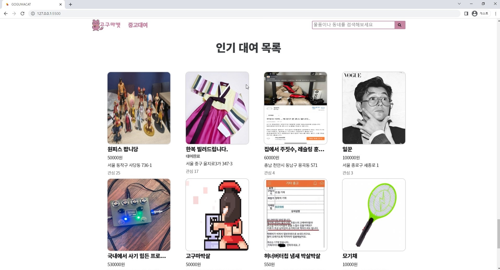

    <br>
</details>

<br>
<br>

### 3-2. **게시판기능**
이 서비스는 사용자가 글을 올림으로서 거래라는 명목이 활성화 됩니다.<br>
이로인해 다른 누군가가 글을 확인 할 수 있고 그로인해 거래가 완료 되어 글이 수정되거나 삭제되는 등 <br>
게시판 기능이 이 서비스의 핵심이라고 볼 수 있습니다.<br>
<br>

<details>
<summary style="cursor : pointer;">기능 설명 펼치기</summary>

*   <span style="font-size : 15px; font-weight : bold">목록페이지</span>   
:mag: [코드확인](https://github.com/hoinlee-moi/GogumacatFrontEnd/blob/72f129fa619388fd739c96c09cd1b6926e2ed8eb/js/list.js#L16)<br>
    - jQuery의 Ajax를 이용하여 데이터를 받아 전체 목록을 쭉 띄워주도록 하였습니다.<br>
    - Ajax콜을 할 때 들어가는 값에 따라 최신순과 좋아요 순으로 나뉘도록 하였습니다.<br>
    - 각 게시글마다 존재하는 id값이 있으며 id값을 URL에 넣어 상세페이지로 연결합니다<br>
    <br>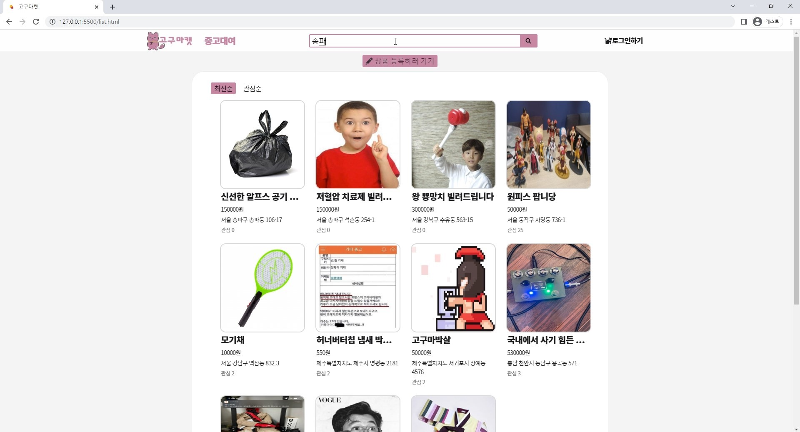
    <br>
    <br>
* <span style="font-size : 15px; font-weight : bold">검색기능</span>   
:mag: [코드확인](https://github.com/hoinlee-moi/GogumacatFrontEnd/blob/72f129fa619388fd739c96c09cd1b6926e2ed8eb/js/list.js#L35)<br>
    - [search.js](https://github.com/hoinlee-moi/GogumacatFrontEnd/blob/7ac7577ea9cccd3fe6d6b67832bf1209dc270f5f/js/search.js#L1) 에 입력된 코드를 통해 검색 값을 받아 도메인에 넣어줍니다.
    - URL에서 데이터 값을 꺼내 Ajax로 백엔드에 요청 받은 데이터 목록을 띄워줍니다.<br>
    - 검색을 했을 때 어떻게 값을 받아야 하나를 고민했는데 팀원과 튜터님의 도움으로 URL에서 값을 받아오는 방법을 확인하였습니다.<br>
    <br>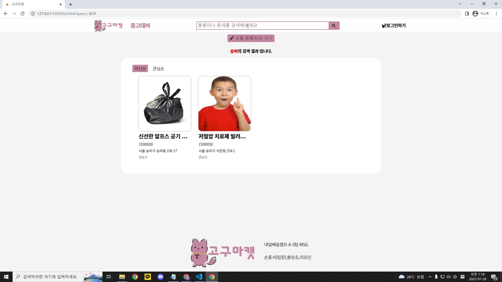
    <br>
    <br>
* <span style="font-size : 15px; font-weight : bold">글 상세 페이지(글삭제)</span>   
:mag: [코드확인](https://github.com/hoinlee-moi/GogumacatFrontEnd/blob/7ac7577ea9cccd3fe6d6b67832bf1209dc270f5f/js/post.js#L14)<br>
    - 각 게시글마다 정해진 id값을 있는데 이걸 어떻게 페이지로 연결시켜야 하는지 고민하다 검색기능을 구현할 때 사용한 방식을 이용 
    - URL에서 id값을 받아 Ajax로 백엔드에 요청, 받은 데이터로 상세페이지를 구성하였습니다.
    - 접속한 유저가 토큰을 가지고 있는지와 게시글에 등록된 username과 접속한 username이 같은지를 비교하여 삭제 수정등의 기능을 비 활성화 합니다.<br>
    - 상단의 모든 조건이 통과 될 경우 글 삭제를 누를 시 Ajax로 토큰과 함께 통신을 보내 db상 데이터를 삭제합니다.   
    :mag: [코드확인](https://github.com/hoinlee-moi/GogumacatFrontEnd/blob/424b0ad03085d21146d057612f4545c002182c37/js/post.js#L207)<br>
    <br>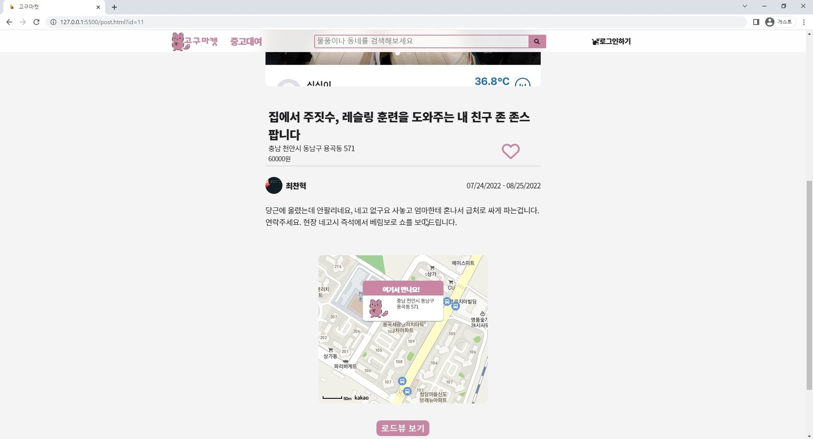<br>
    <br>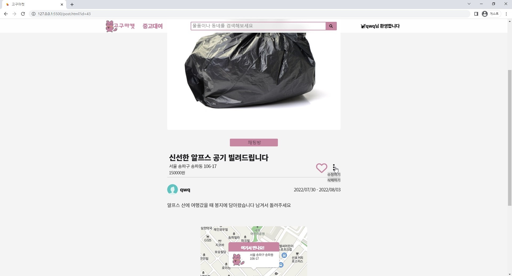
    <br>
    <br>
* <span style="font-size : 15px; font-weight : bold">글 작성 페이지</span>   
:mag: [코드확인](https://github.com/hoinlee-moi/GogumacatFrontEnd/blob/3601a0b7c990165f863d2582fade1d508690df68/js/posting.js#L9)<br>
    - 글 작성전에 유저가 로그인을 한 상태인지 쿠키에 저장된 토큰을 확인합니다.<br>
    - 날짜 부분에서 jQuery로 이루어진 달력 라이브러리를 사용했습니다   
    :mag: [코드확인](https://github.com/hoinlee-moi/GogumacatFrontEnd/blob/3601a0b7c990165f863d2582fade1d508690df68/js/overlap-posting.js#L107)<br>
    - 지도와 주소부분에서 kakao API공식 문서를 바탕으로 주소 검색과 지도 확인을 구성하였습니다.<br>
    - 등록 버튼을 누를 시 입력된 값과 이미지 파일을 FormData에 담아 Ajax로 토큰과 함께 백엔드에 전송합니다.   
    :mag: [코드확인](https://github.com/hoinlee-moi/GogumacatFrontEnd/blob/3601a0b7c990165f863d2582fade1d508690df68/js/overlap-posting.js#L36)
    <br>
    - 전체적인 구성을 하는 건 간단하였으나 마지막 FormData를 이용하여 Ajax콜을 하는 것은 처음이라 오류가 있었습니다.(백엔드에 데이터가 도착하지 않음)
    - 하나씩 FormData 어떤 데이터가 담기는지 console.log로 찍어 input파일이 담기지 않는 것을 확인했습니다.
    - file의 데이터를 제대로 추출하지 못해서 생긴 문제로 document 쿼리를 이용하여 콘솔창으로 파일이 담기는 형태를 파악하여 추적해서 담았더니 해결하였습니다.
    <br>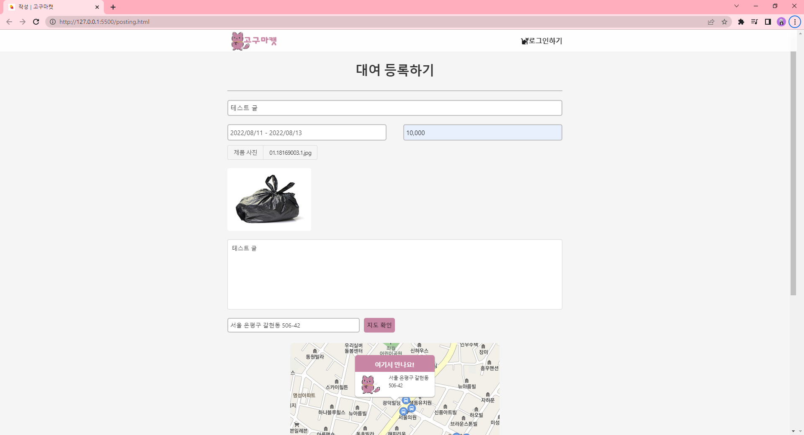
    <br>
    <br>
* <span style="font-size : 15px; font-weight : bold">글 수정 페이지</span>   
:mag: [코드확인](https://github.com/hoinlee-moi/GogumacatFrontEnd/blob/424b0ad03085d21146d057612f4545c002182c37/js/posting-update.js#L39)<br>
    - 글 수정 페이지 들어오기 전 url을 통한 우회 접속을 막기 위해 토큰 검사 및 로그인 한 유저와 글 작성 유저가 동일한지 확인합니다.   
    :mag: [코드확인](https://github.com/hoinlee-moi/GogumacatFrontEnd/blob/424b0ad03085d21146d057612f4545c002182c37/js/posting-update.js#L133)<br>
    - url을 통해 id 값을 뽑아 내어 해당하는 게시글의 데이터를 Ajax로 불러와 각 요소에 삽입합니다.<br>
    - 수정 완료 버튼을 누를 시 각 요소의 유무를 파악 후 Ajax를 통해 해당 게시글 데이터를 업데이트 합니다<br>
    - 이 때 무응답 오류가 생겼었는데 이는 파일이 변경되지 않을시 생기는 오류였습니다.
    - 글을 등록할 때 파일 그자체를 s3 버킷에 추가, 버킷에 저장된 URL만 가져와 이미지를 띄워주기 때문에 실제로 수정페이지엔 file 자체가 들어가지 않는 것을 확인
    - 글 등록할 때 추출했던 코드를 이용하여 if문으로 파일 유무를 걸러 FormData에 담고 백엔드 보내주도록 하였습니다.
    - 이는 백엔드에서도 파일 유무를 확인하여 update되도록 팀원과 함께 동시에 수정을 진행하였습니다.
    <br>
    <br>
    <br>
</details>
<br>
<br>

### 3-3. **Open API 사용**
사이트의 기능을 구현하는데 있어 필요한 부분들을 Open API를 이용하여 구현하였습니다.<br>
<br>
<details>
<summary style="cursor : pointer;">기능 설명 펼치기</summary>

* <span style="font-size : 15px; font-weight : bold">상세 페이지 내 카카오 지도API</span>   
:mag: [코드확인](https://github.com/hoinlee-moi/GogumacatFrontEnd/blob/7ac7577ea9cccd3fe6d6b67832bf1209dc270f5f/js/post.js#L133)<br>
    - kakao api 공식문서를 통하여 지도 api를 구현하였으며 커스텀 오버레이를 통해 고구마캣 대표 색감과 캐릭터 이미지로 변경하였습니다.
    - 버튼을 통하여 지도와 로드뷰를 번갈아 확인할 수 있도록 구현하였습니다.<br>
    - 카카오 api를 사용하기 위해 주어진 앱 키의 보안상의 문제가 고민되었습니다
    - 앱 키를 추출하여도 카카오 api페이지 내에서 플랫폼을 등록을 통해 더블체킹으로 사용이 불가능한 것을 확인하였지만 추후 보안 강화를 위해 주기적인 앱키 변경 필요(카카오 dev talk 검색)
     

    <br>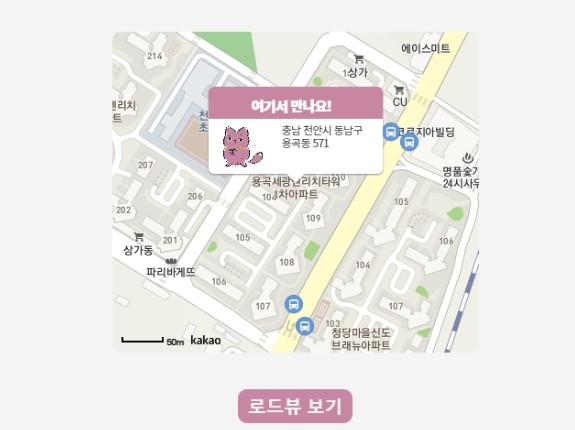<br>
    <br>
    <br>
    <br>
* <span style="font-size : 15px; font-weight : bold">주소 검색 API</span>  
:mag: [코드확인](https://github.com/hoinlee-moi/GogumacatFrontEnd/blob/7ac7577ea9cccd3fe6d6b67832bf1209dc270f5f/js/overlap-posting.js#L90)<br>
    - kakao(daum)우편번호 api를 이용하여 구현하였으며 공식문서를 통해 어떤 주소를 입력해도 지번 주소로 출력 되도록 변경하였습니다<br>
    - api구현할 때 지번 주소로만 출력이 되도록 설정하기로 팀원 회의가 결정이 났습니다.
    - api 사용이 익숙하지 않아 어떻게 해야 할까를 고민하다 daum에서 api와 함께 주어지는 공식문서를 활용하여 기능들을 하나씩 대입해 보았습니다.
    - 그리고 구글링과 이미 api를 사용해 본 팀원에게 도움을 요청하여 원하는 결과값이 도출되도록 성공하였습니다.
    <br><br>
    <br>
    <br>
</details>
<br>

### 3-4. **AWS와 git actions를 통한 배포 자동화**
프론트와 백을 분리하여 진행하면서 Git과 AWS의 s3, cloudfront를 이용하여 배포 하였고 git actions를 이용하여 배포 자동화까지 구현하였습니다.
이후 gabia에서 도메인을 구입하여 aws의 cloudfront에 연결, 도메인 변경까지 완료하였습니다.
<br>
<br>
<br>

>## 4. **트러블 슈팅**
<br>

<span style="font-size : 20px; font-weight : bold">핵심 트러블 슈팅</span>
<br>

<span style="font-size : 15px; font-weight : bold">4-1.프론트와 백 분리 </span>
<details>
<summary style="cursor : pointer;">4-1. 트러블 슈팅 펼치기</summary>

* 처음 프로젝트를 시작할 땐 제가 프론트로 전향 전이라 프론트 인원 자체가 없었습니다
* 기존 프로젝트는 python의 flask로 서버를 구성하여 만들었습니다. 이때는 SSR로 구성하였는데 Java로 개발 언어를 바꾸는 과정에서 프론트도 함께 변경해야하는 것과 백엔드에서 생기는 버그에도 프론트 코드까지 재빌드 되는 불편함을 느껴 분리하는 작업을 진행하였습니다.<br>
<br>
    - 이 과정에서 프론트는 사용하였던 템플릿 언어(timeleaf)를 전부 제거 하였습니다.<br>
    - 새롭게 페이지를 구성하며 css가 충돌되는 현상이 있었습니다
    - 크롬 개발자 도구를 사용하여 각 html요소들이 가지는 CSS를 확인해보니 부트스트랩과 bulma라는 css라이브러리들을 사용할 때 가지는 default값이 문제라고 판단, 삭제후 직접 html과 css를 구현하였습니다.<br>
    - 템플릿 언어를 사용하며 html내에서 javascript나 CSS들을 혼합하여 사용되는 중입니다.<br>
    - 이는 정보와 제어 분리가 안되므로 javascript와 CSS를 파일로 분리 하여 중복되는 js코드들이 재활용 할 수 있었으며 캐쉬를 통해 속도 향상, 전송량의 경량화를 도모할 수 있었습니다.
    - 백과 분리되어 끊어진 통신을 api명세서를 바탕으로 jQuery(Ajax)를 이용하여 데이터 통신을 완료 했습니다.<br>
    <br>

* **수정전코드**<br>

    ``` html
    <div class=content-name;>
        <h1 th:text="${post.title}">글제목</h1>
        <h4 th:text="${post.price} +'원 (1일 기준)'">0원 (1일 기준)</h4>
        <h5 th:text="${post.date}">작성 일자</h5>
    </div>
    <div class="content-info" style="white-space: pre-line">
        <br>
        <p th:text="${post.content}">게시물 내용</p>
    </div>
    ```
    <br>

* **수정후코드 - javascript로 데이터를 받아 각 element값을 채워줬습니다.**<br>
    ```html
    <div class="post-img-container">
            <div class="post-img" id="post-img-box">
                
            </div>
        </div>
        <div id="chat-box">
        </div>
        <div class="post-title-container">
            <div class="post-title">
                <p id="postTitle"></p>
                <p id="postAddress"></p>
                <p id="postPrice"></p>
                <p id="postSold"></p>
    ```
    ```javascript
    function getDetail(postId) { 
        $.ajax({
            type: "GET",
            url: `${domain}/post/detail/${postId}`,
            data: {},
            dataType : "json",
            beforeSend: function(xhr) {
                xhr.setRequestHeader("token", token);
            },
            success: function (response) {
                write_user = response['post']['writeUserId']
                makeDetail(response)
            },
            error:() => {
                alert('잘못된 접근입니다.')
                window.history.back()
            }
        })
    };
    ```

</details>
<br>

<span style="font-size : 15px; font-weight : bold">4-2. 유저 보안 </span>
<details>
<summary style="cursor : pointer;">4-2. 트러블 슈팅 펼치기</summary>

* 프로젝트 완성이후 고객 피드백을 받는 과정에서 url을 변경을 통한 접속시 토큰이나 유저에 상관없이 접속 되는 경우가 발생하였습니다.<br>
이로인해 로그인 하지 않은 사람 또는 다른 회원이 다른 사람의 글을 마음대로 변경할 수 있었습니다.
    - 이는 수정페이지를 들어오기 전 페이지에서 토큰을 검사할 뿐 url을 통한 페이지 바로 접속일 때 토큰과 유저 검사가 없었기 때문인 걸 발견하였습니다.<br>
    - 로그인에 관한 문제는 Cookie에 저장된 토큰을 jQuery로 불러와 존재하는지 유무로 간단히 검사할 수 있었습니다.<br>
    - 유저에 대해서는 접속한 유저의 id를 가져올 방법을 떠올리다 다른 페이지에서 로그인을 할 경우 상단 배너에 ajax콜로 프로필 데이터를 불러와 닉네임이 추가되는 것을 생각하였습니다.<br>
    - 수정페이지에 들어갈 때도 똑같이 로그인 한 프로필 데이터를 불러와 글 작성자의 id를 비교할 수 있도록 만들었습니다. 또한 페이지 로드시 바로 검사하도록 추가했습니다.<br>
    - 만약 URL의 id값을 비 정상적인 값으로 접근 시 ajax콜을 거부, error 메세지 와 페이지 접근 불가 조치로 해결하였습니다.<br>
    <br>
* **추가된 코드**

```javascript
function token_check() {
    if(!token) {
        alert('로그인이 필요합니다')
        window.history.back()
    }
}

function user_check() {
    connet_id = document.querySelector('.logo-container #loginName-0').textContent
    console.log(connet_id,write_id)
    if(connet_id != write_id) {
        alert('올바르지 않은 접근입니다.')
        window.history.back()
    }
}

window.addEventListener('load',() => {
    token_check()
    parameter()
    post()
})
```
<br>

</details>
<br>

<span style="font-size : 15px; font-weight : bold">4-3. git actions를 이용한 자동배포시 s3내 파일이나 cloudfront의 캐시가 변경되지 않는 문제 </span>
<details>
<summary style="cursor : pointer;">4-3. 트러블 슈팅 펼치기</summary>

* 자동 배포 완료 후 첫 테스트를 진행하니 s3내의 파일중 index를 제외하곤 변경된 내용이 저장되지 않는 문제점을 발견하였습니다.
    - 문제 해결을 위하여 테스트를 진행 할 때 git actions의 동작을 확인하고 올바르게 로드 되면 버킷 내의 파일이 변동 되었는지 확인하는 식으로 순차적으로 위를 올라가던 도중 s3내의 파일들이 변경 되어 있지 않은 것을 확인하였습니다.
    - 이는 git actions가 로드 될 때 통제하는 부분이 main.yml뿐이 없기에 해당 파일의 코드를 확인하여 exclud와 include의 단어 index.html만 되어 있는 부분을 확인하였습니다.
    -  AWS 자동배포를 공부할 때 사용했던 main.yml 코드를 그대로 가지고 온 것이 문제였습니다.
    - 해당된 코드를 주석처리하여 test 해본 후 정상 작동을 확인하여 해당 코드를 삭제 하였습니다.
    (with부분 삭제)<br>
    - 하지만 이후 S3에 새롭게 빌드된 파일들의 ACL이 private으로 바뀌어 페이지 자체가 ACCESS DENIED 되었습니다.
    - 이는 구글링을 통하여 main.yml을 변경하는 것이 아닌 버킷 정책을 통하여 public으로 바꿀 수 있다는 것을 확인, AWS공식문서에서 제공되는 버킷 정책을 통하여 버킷을 public으로 변경하였습니다.
    <br>
* **수정전코드**
```yml
    steps:
      - name: Checkout source code.
        uses: actions/checkout@master

      - name: Upload binary to S3 bucket
        uses: jakejarvis/s3-sync-action@master
        with:
          args: --acl public-read --exclude '*' --include 'index.html'
        env:
          AWS_S3_BUCKET: ${{ secrets.BUCKET_NAME }}
```
<br>

* **수정후코드**
```yml
steps:
      - name: Checkout source code.
        uses: actions/checkout@master
      - name: Upload binary to S3 bucket
        uses: jakejarvis/s3-sync-action@master
        env:
          AWS_S3_BUCKET: ${{ secrets.BUCKET_NAME }}
```
<br>

* 상단의 문제를 해결 한 뒤 S3내에선 코드 변경이 확인 되었지만 cloudfront에선 index파일 또한 캐시 삭제가 되지 않고 처음 배포된 상태 그대로 유지되는 문제점 또한 발견하였습니다.
    - 이는 상단의 문제를 확인하여 S3 버킷 내의 파일 또한 변경되는 것을 확인하였으나 페이지까지 배포되지 않았습니다.
    - 페이지 개발자 도구를 이용하여 네트워크 탭에서 페이지가 로드 될 때 불러오는 js파일의 소스를 확인하여 변경 전 js파일이 남아있음을 확인하였습니다.
    - 튜터님에게 도움을 요청하여 cloudfront는 캐시 리빌딩에 시간이 꽤 소요됨으로 main.yml에서 캐시삭제 관련 내용을 추가해야 한다는 것을 확인했습니다
    - 이는 위와 같은 main.yml 코드문제 였는데 cloudfront 코드 부분에서 캐시 초기화가 입력되어 있지만 PATHS를 /index.html로 지정하여 생긴 문제로 확인하여 /* 전체로 수정하여 해결하였습니다.
    <br>
    <br>
* **수정전코드**
```yml
- name: Invalidate cache CloudFront
        uses: chetan/invalidate-cloudfront-action@master
        env:
          DISTRIBUTION: ${{ secrets.DISTRIBUTION_ID }}
          PATHS: '/index.html'
        continue-on-error: true

```
<br>

* **수정후코드**
```yml
- name: Invalidate cache CloudFront
        uses: chetan/invalidate-cloudfront-action@master
        env:
          DISTRIBUTION: ${{ secrets.DISTRIBUTION_ID }}
          PATHS: '/*'
        continue-on-error: true
```
<br>
</details>
<br>

<span style="font-size : 20px; font-weight : bold"> 트러블 슈팅</span>
<br>

<span style="font-size : 15px; font-weight : bold">4-4. 메인페이지 스크롤 애니메이션 에러 
</span>
<details>
<summary style="cursor : pointer;">4-4. 트러블 슈팅 펼치기</summary>

* 스크롤을 이용한 인터렉션 페이지를 만드는 도중 사용자가 스크롤 할 때마다 계속해서 애니메이션이 재 시작되는 문제를 발견하였습니다.
    - 문제점을 알아보기 위해 함수가 실행될 때마다 console.log를 이용하여 실행 타이밍을 확인 
    - requestAnimationFrame로 구현하였는데 addEventListener()를 스크롤로 하고 함수 실행 제제가 마땅히 들어가 있지 않아 해당 섹션에서 스크롤이 될 때마다 무한 재실행 되는 것을 콘솔로 확인하였습니다.
    - 이에 스크롤 비율, 섹션 나누기 등을 통하여 제제를 테스트 하던 중 클래스 네임 변경을 이용하는 것을 생각했지만 생각보다 부드러운 프레임이 되지 않았습니다.
    - 그래서 requestAnimationFrame로 구현한 부분을 과감히 포기, 같은 기능을 이용하는 토스의 페이지 소스를 확인하던 중 class네임 변경을 통한 css적용으로 애니메이션을 구현하는 것을 확인했습니다.
    - 진행한 코드를 과감히 삭제 후 CSS의 keyframs 애니메이션 효과를 이용 class명 유무를 트리거로 두어 특정 위치에서 스크롤 될 시 한 번만 애니메이션이 실행되도록 변경하였습니다.

</details>
<br>

<span style="font-size : 15px; font-weight : bold">4-5. canvas 이미지 무응답 에러 </span>
<details>
<summary style="cursor : pointer;">4-5. 트러블 슈팅 펼치기</summary>

* 이미지 파일을 canvas로 그릴 때 아직 load되지 않아 페이지 로딩시 에러 없이 흰색 화면만 출력되었다.<br>
    - 무응답 오류라 console.log를 사용하여 찍어보기도 하였고 네트워크에서 해당 이미지 파일을 불러오는 것인지도 확인했습니다.
    - 이후 HTML에서 test용 img태그에 같은 이미지를 넣어 확인하니 canvas에 이미지가 삽입 되고 img태그를 삭제하니 다시 무응답 오류가 되는 것을 발견했습니다.
    - canvas는 javascript를 통해 이미지가 로드되고 img 태그는 html을 통해 이미지가 로드 되니 이미지가 준비 되기 전에 canvas가 그려져 무응답 흰색 화면만 출력되는 것을 찾아냈습니다.
    - 해당 문제점을 구글링을 통해 이미지가 로드 되고 canvas에 image를 넣어줄 수 있도록 image.onload 사용하여 해결했습니다.
    - 이후 최초 로딩 화면을 구현함으로서 로딩 화면이 끝난 후 canvas가 그려질 수 있도록 함수 위치를 변경하여 image.onload는 제거하였습니다.
</details>
<br>

<span style="font-size : 15px; font-weight : bold">4-6. jquery 에러 </span>
<details>
<summary style="cursor : pointer;">4-6. 트러블 슈팅 펼치기</summary>

* 글 작성과 글 수정 페이지에서 jQuery가 아예 동작하지 않는 오류가 발생하였습니다.<br>
    - 문제점을 찾기 위해 개발자 도구 창을 이용하여 에러를 확인하였습니다.
    - javascript 코드 내 $ 시작부터 에러를 발생하는 것을 통해 $를 사용하는 jQuery의 문제점으로 파악하였습니다.
    - HTML에 정상적인 jQuery 라이브러리가 스크립트 되어 있는지를 먼저 확인 후 페이지 개발자 도구의 네트워크 탭을 통해 jQuery가 정상 로드되는 것을 확인해 보았습니다.
    - 확인 결과 jQuery가 2번 로드 되는 것을 확인 달력 라이브러리를 가져올 때 생긴 문제로 다른 버전의 jQuery를 2번 로드하여 생겼다고 판단하여 구 버전 로드를 삭제하니 정상 작동하였습니다.

</details>
<br>

<span style="font-size : 15px; font-weight : bold">4-7. UI/UX 디자인 </span>
<details>
<summary style="cursor : pointer;">4-7. 트러블 슈팅 펼치기</summary>

* 초기 디자인은 매우 단조로웠으며 사용자 편의성도 매우 낮았습니다. 이후에 수정된 부분들도 부족한 부분이 많아 계속되는 수정을 거쳤습니다.<br>
    - 기존 페이지 구성시 bulma와 부트스트랩을 이용하여 가지고 있던 기존 CSS들 때문에 새롭게 추가된 css들과 충돌이 일어났습니다.
    - 해당 요소들을 삭제하고 클레스나 id 등이 직관적이지 않은 부분을 전부 삭제 후 재 구성하였습니다.
    - 그리고 각 페이지 별로 직접 사용하며 불편한 점들을 하나하나 고쳐 나갔습니다. 
    - 엔터키로 검색이 되지 않는 부분, 색감이나 페이지 구성이 한 눈에 들어오지 않는 부분 등
    - 또 list페이지로 돌아올 버튼이 없는 것, 로그인 버튼이 명확하게 주어지지 않아 사용자가 처음 접속 시 로그인 하기 어려운 점, 첫 메인 페이지에서 바로 list들을 보러가려면 상단 배너의 버튼을 클릭해야 하는 등의 사용자 편의에 불편한 부분들을 수정을 통해 완화하였습니다.
</details>
<br>

<span style="font-size : 15px; font-weight : bold">4-8. 추가 수정시 발생되는 에러 </span>
<details>
<summary style="cursor : pointer;">4-8. 트러블 슈팅 펼치기</summary>

* 프로젝트를 처음 시작할 때 필요한 html요소들이나 domain, token등을 따로 상단에 모아두지 않아 수정시마다 전체에서 검색하여 고쳐야 되는 문제가 발생하였습니다.<br>
    - 각 함수마다 변수명을 새로 지정하며 document 퀴리를 이용하여 불러왔었는데 이로인해 중복코드들이 굉장히 많아졌습니다
    - 또한 프론트를 분리하여 재 구성할 때 변경된 요소 id명 클래스 네임에 맞게 재활용 한 javascript 코드들을 변경할 때 하나하나 찾아가며 변경하고 오타나 변경 안된 부분으로 인해 에러가 발생했습니다.
    - 그로인해 새롭게 프론트를 구성할 때 코드를 진행하며 필요한 변수와 html 요소들을 한꺼번에 상단에 모아두어 정리한 뒤 하단부 코드에서 직접적으로 사용하는 것이 아닌 정리한 변수들을 사용하여 적용하였습니다.
    - 이로인해 수정 변경이 있을 시 상단에 코드를 추가한다거나 변경하여 전체 코드를 찾아가며 수정하는 번거로움이 사라졌습니다.<br>
    <br>
* **수정코드**<br>
```javascript
//도메인과 토큰
const domain = "http://www.hongseos.shop"

const token = $.cookie("mytoken")

//파라미터 닮을 배열
const paramArray = [];
let id = 0;
//비교할 유저 아이디
let connet_id;
let write_id;

//각 input 값 변수 지정
const inputInfo = [{
    type : 'input',
    objs : {
        title : document.querySelector('#posting-title'),
        date : document.querySelector('#calendar'),
        price : document.querySelector('#price'),
        content : document.querySelector('#content'),
        address :document.querySelector('#local_address'),
        file : document.querySelector('#img'),
        file_name : document.querySelector('#file-js-example .file-name'),
        file_preview : document.querySelector('#image_preview #img_pre')
    }
}]
const objs = inputInfo[0].objs
```
</details>
<br>

>## 5. 회고 / 느낀점
<br>

* ### **회고**
    - [개인블로그](https://velog.io/@lee_moi/1%EB%B2%88%EC%A7%B8-%ED%94%84%EB%A1%9C%EC%A0%9D%ED%8A%B8-%ED%9A%8C%EA%B3%A0)
<br>

* ### **느낀점**
    - [개인 블로그](https://velog.io/@lee_moi/WIL-15202207025-0731-%EC%B2%AB-%ED%94%84%EB%A1%9C%EC%A0%9D%ED%8A%B8%EC%9D%98-%EB%81%9D)


### 📱MINI

---

### **1.TO DO LIST ( pre - onboarding)**

> 기본적인 할일 체크 리스트
> 
- 기술 스택
    - React / React-router-dom / Axios / Firebase
<br>
<a href="https://github.com/hoinlee-moi/wanted-pre-onboarding-frontend">프로젝트 상세정보</a><br>
<br>

## 🧑**Contact**

- **E-mail** :  lhi3048@gmail.com
- **Blog** : [https://velog.io/@lee_moi](https://velog.io/@lee_moi)
- **Github** : [https://github.com/hoinlee-moi](https://github.com/hoinlee-moi)
<br>

## ☝**introduce**
- - -
🧑🏻‍💻Junior Frontend Engineer
<li>Career ㅡ 신입</li>
<li>Birth ㅡ 1994</li>
<li>Address ㅡ Seoul </li>
<br>
